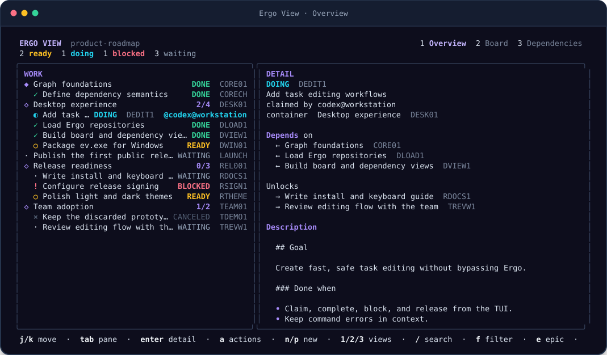
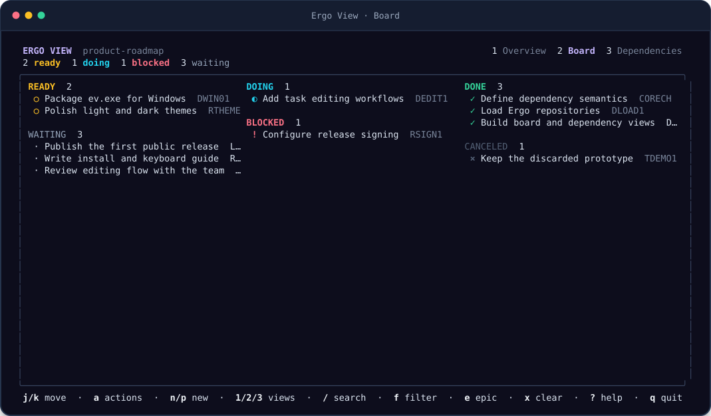
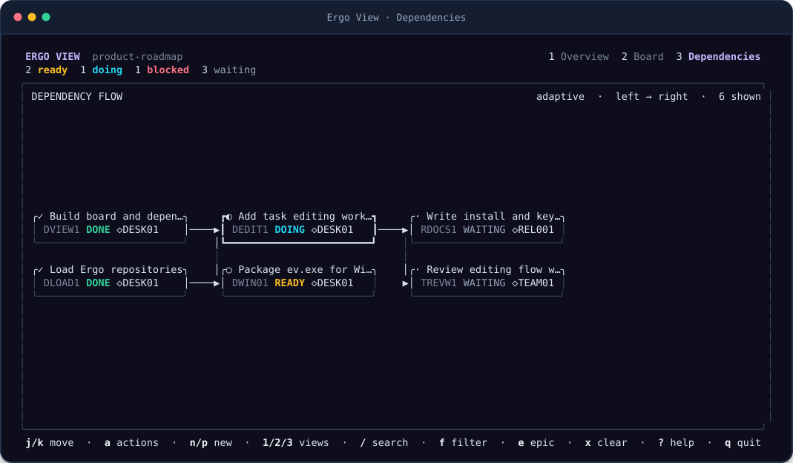

# Ergo View

Ergo View is a responsive terminal companion for [Ergo](https://github.com/sandover/ergo). It turns local epics, tasks, dependencies, and activity into a fast Bubble Tea interface while keeping Ergo itself in charge of every change.



## Install

Ergo View requires Go 1.25.8 or newer and Ergo 3 available as `ergo` on `PATH`.

```sh
go install github.com/jamestjsp/ergoview/cmd/ev@latest
```

Tagged releases also provide `ev` archives for macOS and Linux and `ev.exe` ZIP files for Windows. Download the archive for your platform from [Releases](https://github.com/jamestjsp/ergoview/releases), extract it, and put the executable on `PATH`.

Run `ev` anywhere inside an Ergo project:

```sh
cd my-project
ev
```

Use `--dir` to start discovery elsewhere, `--agent` to set the identity used by claims, or `--ergo` when the Ergo executable is not on `PATH`:

```sh
ev --dir ../my-project --agent codex@workstation
ev --ergo /opt/tools/ergo
```

Ergo View walks upward from the starting path to find `.ergo`. It reads the current `.ergo/plans.jsonl` format and the legacy `.ergo/events.jsonl` filename.

## Views

- **Overview** pairs the task outline with rendered Markdown, dependency context, lifecycle activity, and attached results. Narrow terminals switch between the outline and detail panes.
- **Board** keeps ready, waiting, doing, blocked, done, and canceled work distinct.
- **Dependencies** renders the selected task’s lineage as an interactive terminal graph. Arrows flow from prerequisites toward the work they unlock; task cards carry state and epic membership, while double-border epic cards carry completion progress. The layout automatically chooses horizontal or vertical flow and summarizes branches that do not fit.





All views share selection, fuzzy search, state filtering, and container focus. Ergo View reloads external changes once per second without losing the selected task.

Press `c` or click the copy control in the footer to copy the selected task or container ID. When the Overview detail pane is focused and has a body, the same control copies its raw Markdown instead.

In the dependency graph, use the arrow keys or `h`/`j`/`k`/`l` to move spatially between cards. `Enter` makes the selected card the exploration focus, `Esc` returns to the previous focus, and `d` cycles direct, adaptive, and full-lineage depth. The adaptive default spends the available terminal cells on the nearest upstream and downstream context; selecting an overflow card reveals more. Mouse clicks select cards directly.

## Interact

Press `n` to create a task, `p` to create a container plan, or `a` to open actions for the selected task. Task actions can:

- claim or resume work;
- mark work done, blocked, canceled, or released;
- rename or replace the Markdown body;
- move a task into a container or back to the root;
- add or remove a dependency.

Lifecycle actions accept an optional message and result path. Multiline fields use `Ctrl+S` to continue. Destructive or state-reopening operations ask for confirmation.

Ergo View never edits the event log. It invokes the official Ergo CLI for every mutation, then reloads the resulting snapshot. Errors stay in the dialog so input is not lost.

## Keys

| Key | Action |
| --- | --- |
| `j` / `k`, `↑` / `↓` | Move selection or scroll details |
| `h` / `l`, `←` / `→` | Move across dependency graph nodes |
| `home` / `G` | First / last task |
| `page up` / `page down` | Move one page |
| `1` / `2` / `3` | Overview / board / dependencies |
| `/` | Fuzzy search ID, title, body, or agent |
| `f` | Cycle state filter |
| `e` | Focus the selected container |
| `x` | Clear search and filters |
| `tab` / `enter` (overview) | Switch or focus overview panes |
| `enter` / `esc` (graph) | Focus graph node / return to previous graph focus |
| `d` | Cycle direct / adaptive / lineage graph depth |
| `c` | Copy the selected ID or focused detail body |
| `a` | Open selected task actions |
| `n` / `p` | New task / container plan |
| `?` | Toggle complete in-app help |
| `q` / `Ctrl+C` | Quit |

Mouse selection and wheel scrolling are also supported.

## Compatibility

Ergo View targets the Ergo 3 command and event model. Reading is tolerant of a partially written final event, but malformed complete events are reported with their file and line number. Set `NO_COLOR=1` for terminals that should not receive color styling.

The executable is named `ev` on macOS and Linux and `ev.exe` on Windows. Release builds cover AMD64 and ARM64 for all three operating systems.

## Develop

```sh
go test -race ./...
go vet ./...
go build -o ev ./cmd/ev
```

Render fixtures and documentation images are reproducible:

```sh
UPDATE_GOLDEN=1 go test ./internal/ui -run 'TestRenderSnapshots|TestDocumentationScreenshots'
```

The data adapter is read-only and UI-independent. The action layer exposes narrow Ergo operations and delegates command execution to a runner, which keeps workflows testable without duplicating Ergo's mutation rules.

## License

[MIT](LICENSE)
